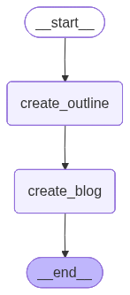

🌦️ LangChain Intelligent Agent — Weather Search + DuckDuckGo Search & **LANGRAPH** SIMPLE PROMPT LLM FLOW WITH **NODES GRAPHS EDGES**

A simple but powerful ReAct-based agent using LangChain, WeatherStack API, and DuckDuckGo Search

🚀 Project Overview

This project demonstrates an intelligent AI agent built using LangChain.
The agent can:

🔍 Search the internet using DuckDuckGo

🌤️ Fetch real-time weather data for any city using WeatherStack

🧠 Reason step-by-step using the ReAct (Reasoning + Acting) framework

🔐 Securely load API keys from .env (preventing accidental GitHub leaks)

This is a great starter project for anyone learning agents, tools, and LangChain in a clean, easy-to-understand architecture.

🧠 Key Features
🔹 1. ReAct Agent

Your agent uses LangChain’s reasoning framework:

Understands a query

Decides which tool to call

Executes the tool

Returns a final structured answer

🔹 2. Custom Weather Tool

You built a WeatherStack wrapper:
@tool
def get_weather_data(city: str) -> str:
    """Fetch current weather for a given city."""
🔹 3. DuckDuckGo Search Tool

Allows the agent to fetch live internet results.

🔹 4. Secure API Management

.env used for:

WEATHERSTACK_API_KEY

Hidden from repo via .gitignore

🛠️ Tech Stack
Component	Technology Used
LLM Framework	LangChain
Agent Type	ReAct Agent
Search Tool	DuckDuckGo Search
Weather API	WeatherStack
Environment Management	.env + python-dotenv
Execution Environment	Jupyter Notebook (VS Code)

📂 Project Structure
📦 project-root/
 ┣ 📜 agents_langchain.ipynb
 ┣ 📜 .env       (not uploaded)
 ┣ 📜 .gitignore
 ┗ 📜 README.md

🔐 Environment Setup
1️⃣ Create .env
WEATHERSTACK_API_KEY=your_key_here

2️⃣ Install dependencies
pip install langchain langchain_openai duckduckgo-search python-dotenv

3️⃣ Run notebook

Open agents_langchain.ipynb in VS Code → Run All
User Input:

"What is the weather in Tokyo and give me 1 fun fact from the internet?"

Agent Reasoning:

Call Weather Tool → Fetch Tokyo weather

Call DuckDuckGo → Get fun fact

Combine & format answer

Return final output

🚀 LangGraph Workflow – Prompt_Langraph.ipynb

This notebook demonstrates how I built a LangGraph workflow to visualize an LLM reasoning chain.

What it includes:

A custom LLM workflow graph built using LangGraph

A clear visual representation of the agent flow

Execution of the graph with a sample prompt

Generated image output for the graph

Graph Output Example:

Notebook:
Prompt_Langraph.ipynb
